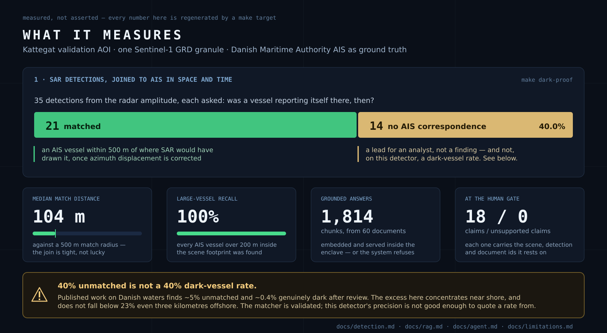
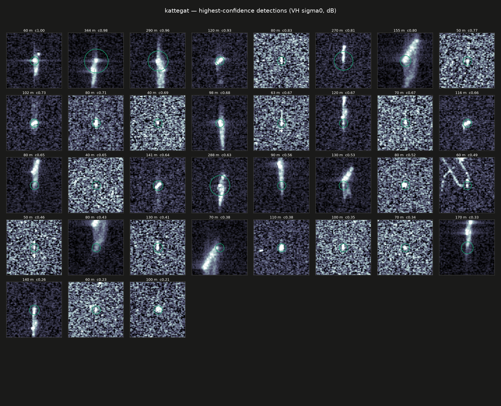

# NIGHTGLASS

**Air-gapped SAR intelligence assistant.** Finds vessels in Sentinel-1 radar imagery, checks
them against AIS, and drafts a cited intelligence report — with no route to the internet.

The chat model, the embedding model and the vector store all run inside the enclave; nothing
calls out.


> **A dark detection is a lead, not a conclusion.** A vessel with no AIS correspondence has
> plenty of innocent explanations — satellite revisit gaps, terrestrial receiver limits,
> transponder failure, low-power class B sets, vessels never required to carry AIS at all. The
> system surfaces candidates. The analyst adjudicates.

[demo](#the-demo) · [architecture](#architecture) · [quickstart](#quickstart) ·
[results](#what-it-measures) · [the agent](#the-agent) · [proofs](#seven-proofs-that-run) ·
[all the docs](docs/)

---

## The demo


One command, and nothing in it is staged: the 14B model picks its own tools while the recording
runs, and every number comes out of PostGIS and the SAR pixels as you watch. **57 s live.**

**▶ [`docs/demo.mp4`](docs/demo.mp4)** — 4.0 MB, 49 s, play and pause. This is the one to watch.

**[How it was recorded, why it is retimed rather than re-run, and why it runs over two AOIs →](docs/demo.md)**

---

## Architecture


The boundary is one line of `docker-compose.yml`: the `enclave` network is declared
`internal: true`, so Docker attaches no default route and installs no NAT rule. There is no
egress path to misconfigure, and nothing to keep in sync as services are added.

Two consequences follow, both deliberate. **No service publishes a port** — verified, a `-p`
mapping on an internal network comes up fine and is simply dead. And **nothing inside can fetch
its own inputs**: six profile-gated fetchers on a separate network do that, none of them running
during operation, every byte checksummed against [`data/sources.yaml`](data/sources.yaml).

**[The full argument, and where the credentials live →](docs/architecture.md)**

---

## Quickstart

```bash
cp .env.example .env      # then set POSTGRES_PASSWORD
make preflight            # checks docker, the nvidia runtime, VRAM, the AOI config
make up                   # build + start, waits for every container healthy
make pull-models          # once, ~10 GB   ┐
make fetch-corpus         # once, ~35 MB   │
make fetch-granules       # once, 2.8 GB   ├ the only steps that touch the network
make fetch-ais            # once, 890 MB   │
make fetch-coastline      # once, 149 MB   │ (149 MB in, 713 KB kept)
make fetch-gfw            # once, ~70 detections ┘ the cross-check layer
make ingest               # chunk + embed the corpus into Qdrant (~1 min, offline)
make scenes               # catalogue the granules on disk as STAC items (offline)
make demo                 # the recording above, live, ~60 s
```

`make` with no target lists everything. Two fetches want a free account; nothing else reaches
the network, ever.

**[The accounts, the checksums, and the bundle for a site with no route at all →](docs/quickstart.md)**

---

## What it measures





*All 35 detections at native resolution, VH sigma0 in dB, ordered by confidence. The vertical
smear on most of them is azimuth displacement — a moving target drawn away from where it really
was, which is the correction the space–time join has to make before it can ask AIS anything.*

**[The detector, the azimuth-displacement physics, the join in SQL, and what the 40% does *not* mean →](docs/detection.md)**

---

## The agent


`parse → plan → tools → correlate → draft_intrep → HUMAN_GATE → release`, as a LangGraph state
machine against a Postgres checkpointer. The halt is demonstrated the only way that means
anything — the drafting container *exits*, and a different one picks the run up minutes later
from persisted state.

**[The checkpointer, the resume, and where the model is allowed to act →](docs/agent.md)**

---

## Seven proofs that run

Not screenshots. Each is a `make` target that stands the claim up on your machine, and fails
loudly if it cannot.

| `make` … | demonstrates | detail |
|---|---|---|
| `air-gap-proof` | no route to the internet — and the model answers anyway, in the same session | [air-gap.md](docs/air-gap.md) |
| `rag-proof` | same model, same question, retrieval off then on — and the refusal when nothing supports a claim | [rag.md](docs/rag.md) |
| `dark-proof` | 35 detections, 21 matched at a median 104 m, 14 with no AIS correspondence | [detection.md](docs/detection.md) |
| `tool-proof` | six typed tools over HTTP *and* MCP; the local 14B chains three unaided, and Claude Code drives the same six from outside the enclave over a pipe | [tools.md](docs/tools.md) |
| `agent-proof` | the drafting container exits at the human gate; a different one resumes from persisted state | [agent.md](docs/agent.md) |
| `bundle-proof` | 18 GB across the gap behind a 3.4 MB static Go binary that refuses eight ways before it will restore | [bundle.md](docs/bundle.md) |
| `k8s-proof` | the same boundary as a default-deny NetworkPolicy — proved against a negative control, because a cluster with no route out would also report "blocked" | [kubernetes.md](docs/kubernetes.md) |

---

## Read more

| page | what is in it |
|---|---|
| [**docs/**](docs/) | the index to all of it |
| [design decisions](docs/design-decisions.md) | every choice that had a live alternative, and what it cost |
| [limitations](docs/limitations.md) | tested rather than assumed, and stated before being asked |
| [what three more weeks would buy](docs/roadmap.md) | each item a named gap, not a feature wish |
| [data sources and licences](docs/data-sources.md) | every external input, its use, and its terms |
| [repository layout](docs/repository-layout.md) | what lives where |
| [NOTES.md](docs/NOTES.md) | the running decision log, including what failed |

---

**Attribution.** Contains data from the Danish Maritime Authority that is used in accordance with
the conditions for the use of Danish public data. Sentinel-1 imagery © ESA, via ASF. Global
Fishing Watch detections are CC BY-NC 4.0. Corpus documents carry their own terms —
[the full table](docs/data-sources.md).

Licence: Apache-2.0.
