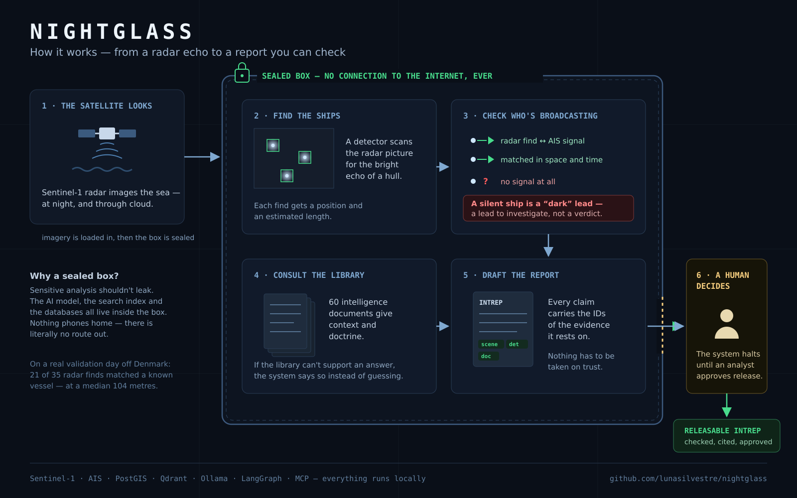
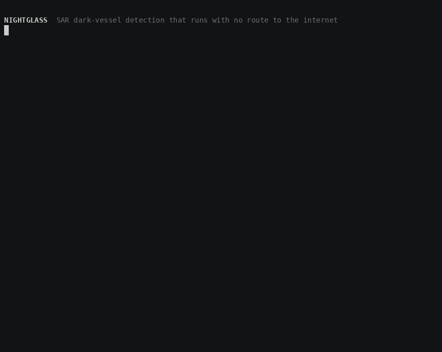
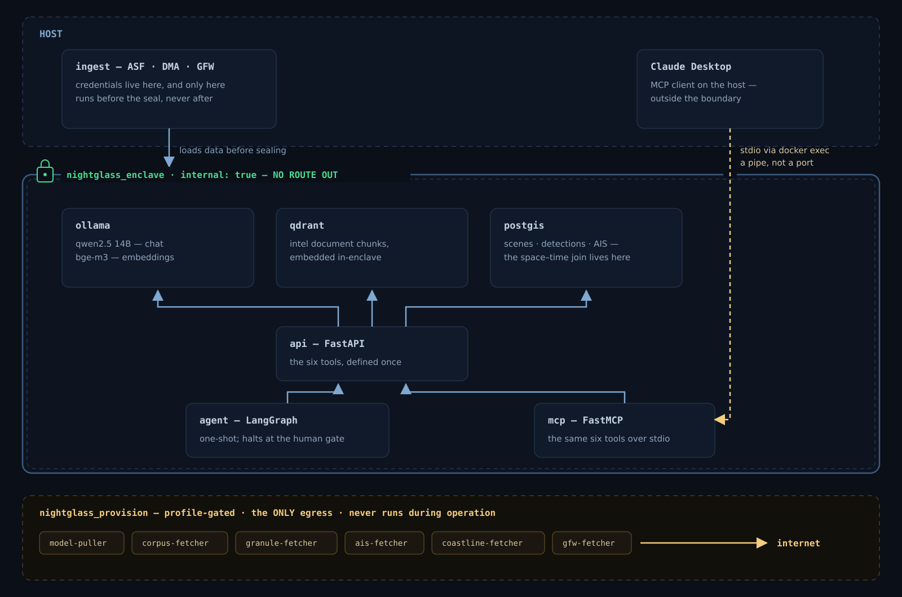
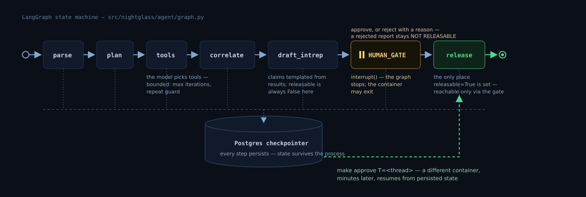

# NIGHTGLASS

**Air-gapped SAR intelligence assistant.** Finds vessels in Sentinel-1 radar imagery, checks
them against AIS, and drafts a cited intelligence report — with no route to the internet.

An analyst asks whether anything undeclared has moved through an area in the last 72 hours. NIGHTGLASS searches the SAR catalogue for scenes covering it, runs its own
detector over the radar amplitude, correlates each detection against vessel position reports in
space *and* time, pulls supporting context out of an intelligence document corpus, and produces
an INTREP in which every claim carries the scene, detection and document IDs it rests on. It
halts for human review before anything is marked releasable. The chat model, the embedding
model and the vector store all run inside the enclave; nothing calls out.

Deliberately shaped as the open-source shadow of ICEYE Ocean Vision Detect.



> **A dark detection is a lead, not a conclusion.** A vessel with no AIS correspondence has
> plenty of innocent explanations — satellite revisit gaps, terrestrial receiver limits,
> transponder failure, low-power class B sets, vessels never required to carry AIS at all. The
> system surfaces candidates. The analyst adjudicates.

**What a clone gets you.** The enclave stands up sealed and runs inference offline. Answers
come from a 60-document corpus with every claim traced to a retrievable chunk — or a refusal.
A vessel detector runs over real Sentinel-1 pixels and its detections are correlated against
real AIS in space *and* time. Six typed tools are served over both HTTP and MCP; a LangGraph
agent chains them, halts at a human gate, and resumes in a different container. Every byte of
input is fetched against a checksummed manifest, so a clone reproduces the demo rather than
reading about it — and the whole system crosses an air gap in one tarball that a static Go
binary refuses six ways before it will restore, then stands the same boundary up again in
Kubernetes as a default-deny egress policy, proved against a negative control. Over the Danish validation AOI, 21 of 35
detections match a vessel that was actually there at a median 104 m, and every AIS vessel over
200 m inside the scene footprint is recovered. The local 14B model chains three tools unaided
from a plain analyst question; Claude Code drives the same tools over a pipe from outside the
enclave. [`docs/NOTES.md`](docs/NOTES.md) is the running decision log.

**Index:** [demo](#the-demo) · [architecture](#architecture) · [quickstart](#quickstart) · [air-gap proof](#the-air-gap-proof) · [grounded answers](#grounded-answers-and-the-refusal-path) · [dark vessels](#dark-vessels-detection-and-a-spacetime-join) · [agent](#the-agent-and-a-gate-that-actually-stops) · [tools](#six-tools-two-consumers) · [bundle](#crossing-the-gap-one-tarball-and-the-ways-it-refuses) · [kubernetes](#the-same-boundary-twice) · [design decisions](#design-decisions) · [data & licences](#data-sources-and-licences) · [limitations](#limitations) · [roadmap](#what-id-do-with-three-more-weeks) · [layout](#repository-layout)

---

## The demo



One command, `scripts/demo.sh`, and nothing in it is staged: the 14B model picks its own tools
while the recording runs, and every number comes out of PostGIS and the SAR pixels as you watch.
It takes **57 s live**.

**▶ [`docs/demo.mp4`](docs/demo.mp4)** — 4.0 MB, H.264, 49 s, play and pause. This is the one to
watch.

The video is **retimed, not re-run**: `scripts/pace-demo.py` rewrites timestamps only — not one
byte of the content — and refuses to write a file whose output stream differs from the source,
so what you see is the real run at a readable pace. The GIF above is the same timeline at a
lower frame rate; [`docs/demo.cast`](docs/demo.cast) is the untouched real-time recording to
check both against (`asciinema play docs/demo.cast`).

The recording runs over the Lisbon AOI. The Lisbon AOI has **no AIS**, and that is not an
oversight — Denmark is the only European state publishing free point-level *historical* AIS,
which is exactly why it is the validation AOI. So the recording shows both, in the order an
analyst meets them: Lisbon takes the question and produces 71 detections with the verdict
**withheld**, the corpus explains why a missing transponder is a lead rather than a finding, a
human releases the report from a different container, and the claim about the matcher is then
made over Denmark, where there is ground truth to make it against. Two AOIs on screen is also
the config-driven argument made visible instead of asserted: nothing in the code knows which AOI
it is serving.

---

## Architecture



The boundary is one line of `docker-compose.yml`: the `enclave` network is declared
`internal: true`, so Docker attaches no default route and installs no NAT rule. There is no
egress path to misconfigure, and nothing to keep in sync as services are added. Default deny by
construction rather than by a firewall rule somebody has to maintain.

Two consequences follow, and both are deliberate:

- **No service publishes a port.** Verified on Docker 29.7.1: a container on an internal
  network started with `-p 18099:80` comes up fine, `docker ps` shows `80/tcp` with no host
  mapping, and the port is dead — with no warning emitted anywhere. So ports are not merely
  omitted for tidiness; they do not work. Access is `docker compose exec`, and MCP reaches
  Claude Desktop over stdio through `docker exec` rather than over a socket.
- **Nothing inside can fetch its own inputs at runtime.** Correct, and it applies to every
  input: weights via `model-puller`, documents via `corpus-fetcher`, the Sentinel-1 granules via
  `granule-fetcher`, the Danish AIS day via `ais-fetcher`, the shoreline via `coastline-fetcher`,
  the GFW cross-check layer via `gfw-fetcher`. Every one is a profile-gated service on the
  `provision` network, invoked explicitly by a `make fetch-*` target, and none is running during
  operation. Provisioning and operation are different security postures and the compose file says
  so out loud rather than blurring them.

  That the list is six items long and not three is itself a finding. The detector's own land
  mask structurally cannot separate a 100 m skerry from a 100 m hull, so a real air-gapped
  deployment has to ship a coastline with it; and validating a detector needs someone else's
  detections, so it has to ship those too. Both are clipped or filtered online — the enclave
  carries 713 KB of shoreline rather than a 149 MB archive, and 69 detections rather than a
  global layer.

  The two data fetchers exist because without them this repository was not *reproducible*:
  granules and AIS had originally been staged by hand, and `data/` is gitignored — so every
  number below was true and none of it could be regenerated anywhere but on one machine. [`data/sources.yaml`](data/sources.yaml) is the
  committed half — a URL, a byte count and a sha256 for all eight external files — and the
  fetchers refuse anything that hashes differently. A number you cannot trace to a byte is a
  number you are asking to be taken on trust.

  Credentials follow the same split. `GFW_TOKEN` and the Earthdata login are provider identities,
  so they live outside the repository — `~/.config/eo-credentials.env` (chmod 600) and `~/.netrc`
  respectively — and are forwarded to the provision service by the invoking shell, never written
  into `.env`, and never reachable from the enclave, where they would be useless anyway. ASF's
  own documentation reaches for `curl --location-trusted`, which means *send the password to
  whatever host redirects you*; `spatial/archive.py` walks the redirect chain itself and attaches
  the credential only when the hop is `urs.earthdata.nasa.gov`.

---

## Quickstart

```bash
cp .env.example .env      # then set POSTGRES_PASSWORD
make preflight            # checks docker, the nvidia runtime, VRAM, the AOI config
make up                   # build + start, waits for every container healthy
make pull-models          # once, ~10 GB   ┐
make fetch-corpus         # once, ~35 MB   │
make fetch-granules       # once, 2.8 GB   ├ the only steps that touch the network
make fetch-ais            # once, 890 MB   │
make fetch-coastline      # once, 149 MB   │ (149 MB in, 713 KB kept)
make fetch-gfw            # once, ~70 detections ┘ the cross-check layer
make ingest               # chunk + embed the corpus into Qdrant (~1 min, offline)
make air-gap-proof        # no egress, inference works anyway
make rag-proof            # ungrounded vs grounded, and the refusal path
make dark-proof           # detector, AIS, the space-time join, and the renders
make tool-proof           # the tools over MCP, and the local model chaining them
make agent-proof          # halts at the human gate, resumes in a different container
make demo                 # the recording above, live, ~60 s
make bundle-proof         # the transfer bundle — four refusals, and a restore
make k8s-proof            # the same air gap as a NetworkPolicy, against a control
```

`make` with no target lists everything.

Two of those need an account, both free: `fetch-granules` wants an
[Earthdata login](https://urs.earthdata.nasa.gov) **with the ASF EULA accepted** — a valid
password on its own produces a redirect loop rather than a 401 — and `fetch-gfw` wants a
[GFW API token](https://globalfishingwatch.org/our-apis/tokens). `fetch-ais` needs neither.
Every fetch is checksummed against [`data/sources.yaml`](data/sources.yaml), resumes a partial
download, and re-runs as a no-op; `make fetch-granules VERIFY=1` re-hashes what is already on
disk instead of trusting its size. The default set is 2.8 GB — everything the proofs and the
demo need; `ALL=1` fetches the full manifest.

**On this machine**, the host runs ollama as a systemd service with `OLLAMA_KEEP_ALIVE=-1`,
which pins ~15 GB of the 3090 permanently and leaves the enclave's own ollama unable to load a
14B model. `make preflight` detects this and tells you to `sudo systemctl stop ollama`. There is
also a `make seed-models` shortcut that copies the blobs already on the host into the volume
instead of re-downloading them — a local convenience, explicitly not the documented path.

---

## The air-gap proof

No route to the internet, and the model answers anyway — in the same session. Reproduce with
`make air-gap-proof`. The boundary is one line of compose — `internal: true` — so there is no
egress path to misconfigure.

**The full capture, and what it does and does not prove → [docs/air-gap.md](docs/air-gap.md)**

---

## Grounded answers, and the refusal path

60 documents, 1,814 chunks, embedded locally with bge-m3 and stored in Qdrant. Reproduce with
`make rag-proof`. The argument for the whole document layer is one comparison: **same model, same
question, same machine — the only difference is whether retrieval is on.** And when eight chunks
come back and none of them supports a claim, the system refuses rather than assembling something
plausible out of adjacent material.

**Both transcripts, the citation plumbing, and the refusal path → [docs/rag.md](docs/rag.md)**

---

## Dark vessels: detection, and a space–time join

`make dark-proof` runs the whole chain over the Danish AOI — schema, scene, detector, AIS, the
query, then the renders. **Denmark, not Portugal, and that is the point of having two AOIs:** it
is the only one with free point-level historical AIS, so it is the only place a claim about the
matcher can be *checked* rather than asserted.

```
detections    35          in the Kattegat AOI, from one Sentinel-1 GRD granule
matched       21          an AIS vessel within 500 m of where SAR would have drawn it
dark          14          no AIS correspondence — 40.0%
```

**The detector, the azimuth-displacement physics, the join in SQL, and what the 40% does *not*
mean → [docs/detection.md](docs/detection.md)**

---

## The agent, and a gate that actually stops

`parse → plan → tools → correlate → draft_intrep → HUMAN_GATE → release`, as a LangGraph state
machine against a **Postgres checkpointer**. `make agent-proof` runs it end to end. The halt is
demonstrated the only way that means anything — the drafting container *exits*, and a different
one picks the run up minutes later from persisted state.



**The checkpointer, the resume, and where the model is allowed to act →
[docs/agent.md](docs/agent.md)**

---

## Six tools, two consumers

`make tool-proof` runs the whole of it: the MCP transport Claude Desktop attaches with, a tool
called over that transport, the local 14B model chaining three tools unaided, and the report
refusing to state the one number it must not. The six tools are defined once — FastAPI serves
them over HTTP, FastMCP serves the same functions over MCP, and the agent calls them in-process.

**The pipe through the wall, the chaining transcript, and the two-sided guard →
[docs/tools.md](docs/tools.md)**

---

## Crossing the gap: one tarball, and the ways it refuses

Everything above assumes the enclave was *built* somewhere with a network. A real site has no
route to ASF, to the Danish Maritime Authority, to a container registry or to PyPI — and one of
those four is on a clock: the DMA serves daily AIS on a rolling ~18-month window, and when
`aisdk-2026-07-17` ages out, no amount of code fixes it. A bundle is what outlives that —
**18 GB behind a 3.4 MB static Go binary that refuses six ways before it will restore.**

**The manifest-first tar, the six refusals, and what actually weighs → [docs/bundle.md](docs/bundle.md)**

---

## The same boundary, twice

Compose gets the air gap from one flag — `internal: true`, no route to misconfigure. Kubernetes
has no such flag: a pod network is routable by default and every pod can reach the internet until
something says otherwise. So the claim is made a second time, as a default-deny egress
NetworkPolicy in a Helm chart, and **proved in both directions from the same pod seconds apart**:

```
a. policy deleted    egress to https://example.com   reached
b. policy applied    egress to https://example.com   blocked
                     qdrant inside the namespace     reached
```

The negative control is the evidence, not decoration. A cluster with no route out would report
"blocked", and so would a CNI that accepts the policy and ignores it — which is exactly what
kind's default CNI does. Hence k3s, which enforces out of the box. `make k8s-proof` fails loudly
if step (a) comes back blocked, because at that point nothing after it means anything.

The host needs no `kubectl`, no `helm` and no `k3s`: the cluster is a container, kubectl lives
inside it, helm runs from an image. And the images arrive as the same per-image tarballs
`make bundle` already writes — the bundle and an offline cluster want the identical artifact.

**The policy, the negative control, and the one way this boundary is weaker than compose's → [docs/kubernetes.md](docs/kubernetes.md)**

---

## Design decisions

| Choice | Reason |
|---|---|
| **Ollama inside the enclave, not the host service** | The host has ollama on `:11434` with the models already pulled, and pointing compose at it would save re-downloading ~10 GB. It also needs `host.docker.internal:host-gateway` — a deliberate hole in the exact boundary this project exists to demonstrate — and it breaks "clone and `make up`". The model server belongs *inside* the enclave because in a real deployment there is no host to borrow from. Cost is paid once via `make pull-models`. |
| Ollama over vLLM / TGI+TEI | **One service serves chat *and* embeddings**; vLLM and TGI are one-model-per-process and would need two containers. Ollama supports fully air-gapped operation, while vLLM needs network configuration to reach full isolation — which is the whole point here. Models are content-addressed blobs in one directory, so the offline bundle is a tar of a folder, not an untangling of a HuggingFace cache — of `models/` only, as it turned out, because the volume also holds the instance's own SSH private key and that must not travel. Honest limit: Ollama serialises concurrent requests and vLLM does ~3.2× the throughput. Irrelevant for one analyst. The line is *"Ollama for the enclave, vLLM if this became multi-tenant."* |
| Qdrant over pgvector | Single binary, trivial offline deploy, no external dependencies. pgvector is already familiar from production work; Qdrant shows breadth and is a common air-gapped default. |
| bge-m3 for embeddings | Genuinely multilingual. Measured: a query against its translated equivalent scores **0.842** cosine, against unrelated text in the same language **0.283** — a 0.56 separation, so it keys on meaning rather than language. Deployments are national and a corpus will not always share a language with its queries; the shipped corpus is now all English, so this is insurance rather than a demonstrated feature. One-way, since changing it means re-embedding everything. |
| Qwen2.5 **14B** at q4_K_M | Fits consumer VRAM (~9 GB weights, ~15 GB resident with a 32k KV cache, on a 24 GB card), strong tool-calling, permissive licence. Verified chaining three distinct tools unprompted from a plain analyst question. |
| LangGraph over CrewAI | An explicit state machine with a genuinely interruptible node, which the human-in-the-loop gate needs. State persists and is inspectable while halted — a bare `input()` only blocks a thread. |
| PostGIS for geometry | Spatial correlation belongs in a spatial database, not in Python. The dark-vessel join is one query in `src/nightglass/spatial/sql/dark_vessels.sql` — track interpolation via `LEAD`, the azimuth-displacement correction via `ST_Project`, distances via `geography` casts so they come back in metres rather than degrees. It stays a `.sql` file so it can be read top to bottom and run a CTE at a time. |
| Scene as a STAC Item, not a bespoke table | `stac_search` is a catalogue query. Modelling the catalogue as STAC keeps the door open to pointing the same tool at a real STAC API — which is what a customer deployment has — rather than at a table only this project understands. The Item is stored whole in `jsonb`; the columns beside it are extracted for indexing. |
| A shoreline is a fourth provisioning input | Weights, documents, granules — and now GSHHG. The detector's own land mask structurally cannot separate a 100 m skerry from a 100 m hull, so an air-gapped deployment genuinely has to ship a coastline with it. Saying that is a better answer to "what does this need bundled" than pretending the list was three items long. |
| A committed manifest, gitignored bytes | `data/sources.yaml` carries a URL, a size and a sha256 for every external input; `data/` carries none of them. The fetchers verify against it and refuse a mismatch, so "the numbers in this README" and "the bytes on your disk" are the same claim. It is also what makes the two data fetchers auditable rather than trusted: a reviewer can check what they are pointed at without running them. |
| The bundler is Go, and the manifest is the first member | A static `CGO_ENABLED=0` binary is *why* Go is here rather than a sixth Python entry point: the thing that unpacks an air-gapped bundle cannot itself need a Python environment to exist first, and `make bundle-proof` runs it inside a `docker:dind` container that has no Python and no Go in order to show that rather than assert it. The host needs no Go either — it is built in `golang:1.26-alpine` and copied out, the way `make test` runs pytest in a container. Putting `MANIFEST.json` first is what makes `verify` one sequential pass: no seeking, no staging, one megabyte of memory across 18 GB, so a bundle can be checked on a pipe as it comes off the medium. The cost lands on `create`, which must read everything before it can write the first member — the right side to put it on, since create runs once per bundle and verify runs every time one moves. |
| k3s over kind, and a negative control over an assertion | **kind's default CNI accepts a NetworkPolicy and does not enforce it.** The object is created, `kubectl get networkpolicy` lists it, and every pod still reaches the internet — so a proof built on kind without swapping the CNI would have passed while demonstrating the opposite of its claim. k3s ships kube-router's policy controller and enforces out of the box, and is closer to what an edge site actually runs; measured, a cluster is Ready about eight seconds after `docker run`. The same reasoning produced the shape of the proof: it reaches the internet with the policy deleted *before* it fails to reach it with the policy applied, because either half alone is consistent with a cluster that simply has no route out. |
| TPS over polynomial GCP fit | Measured on a real granule: polynomial leaves 40 m mean / 185 m worst-case geolocation error, TPS leaves 0.000 m. 15× slower on a cost of 0.15 s per 20,000 points. |
| GRD not SLC | Vessel detection needs amplitude only. Phase is for interferometry, which is out of scope. |
| Agent as a one-shot, not a service | It runs to a human gate and halts. It has nothing to serve between invocations, so a daemon wrapper would exist only to satisfy a healthcheck. |

---

## Data sources and licences

| Source | Use | Licence / terms |
|---|---|---|
| **Sentinel-1 GRD** (ESA, via ASF) | SAR imagery, both AOIs — `make fetch-granules` | Free and open. Requires a NASA Earthdata account and one-time ASF EULA acceptance. |
| **Danish Maritime Authority AIS** | Point-level ground truth, validation AOI — `make fetch-ais` | Public S3, no credentials. See attribution below. |
| **eo-credentials** | `GFW_TOKEN` and friends live in `~/.config/eo-credentials.env`, never in this repo — `scripts/load-env.sh` loads it before `.env`, and a blank value in `.env` means *defer to central* rather than *override with empty*. | — |
| **Global Fishing Watch** SAR detections | Independent reference layer, demo AOI | **CC BY-NC 4.0** — non-commercial, attribution required. |
| **aisstream.io** | Live demonstration feed, demo AOI | Free tier. **Not ground truth** — see Limitations. |
| **ICEYE product documentation** | Document corpus — SAR technical reference | © ICEYE Ltd. Public documentation, **no open licence stated**. Fetched locally, `redistributable: false`, never committed here. |
| **IMO resolutions** | Document corpus — the AIS obligation itself | © IMO. Published via the IMO Knowledge Centre, **no open licence stated**. Same handling. |
| **EUR-Lex** (EU directives and regulations) | Document corpus — EU maritime law | © European Union, 1998–2026. Reuse authorised under Commission Decision 2011/833/EU with attribution. Only legislation printed in the paper Official Journal is authentic. |
| **Copernicus EMS** activation reports | Document corpus — AOI environmental context | © European Union, Copernicus Emergency Management Service. Free, full and open with attribution. |
| Synthetic INTREP/INTSUM memos | Document corpus — doctrine and tradecraft | Written for this project. Marked `UNCLASSIFIED // SYNTHETIC` in both header and metadata, and the marking propagates into anything citing them. Named no real vessel, operator or flag; identifiers use the unallocated MMSI prefix 999. |

> Contains data from the Danish Maritime Authority that is used in accordance with the
> conditions for the use of Danish public data.

---

## Limitations

Stated before being asked, because each one was tested rather than assumed.

- **No free historical, complete point-level AIS exists for Iberian waters.** GFW's ORBCOMM
  sublicence forbids redistributing AIS or any derivative, DGRM publishes nothing, EMSA
  restricts SafeSeaNet to national administrations, and the free satellite-AIS tiers went away
  in the 2025 Kpler/S&P consolidation. So over Portugal, GFW detections are a **reference
  layer** — an independent published product to cross-check against — not an independent
  correlation this system performed.
- **The live aisstream feed is thinned, measured, not guessed.** Same Kattegat bbox, same
  22-minute clock window, against DMA as ground truth: **770 vessels vs 132** — aisstream sees
  about **17%**, missing five in six. Independently, message throughput runs ~1.4 messages per
  vessel per 4 minutes against ~40 expected for a fully-observed class A vessel, roughly **3% of
  expected volume**. Vessel discovery had saturated by minute 10, so recording for longer does
  not close the gap. Absence from a thinned feed is not absence of transmission, so this source
  can demonstrate the matching mechanism but **cannot support a dark-vessel rate**.
- **Therefore: matched pairs over Portugal, rates only over Denmark.** The schema enforces this
  rather than leaving it to prose — `Match.source_is_ground_truth` travels with every match and
  `CorrelationResult.rate_is_quotable` is false unless all of them came from a ground-truth
  feed.
- **Completeness over Portugal cannot be measured at all.** The absence of a DMA equivalent is
  simultaneously why a live feed is needed there and why there is no reference to validate it
  against. Denmark is the only AOI where this is observable, which is much of what the Danish
  AOI is for.
- Single scene per AOI. No CFAR tuning. No accuracy claims beyond what was measured.
- **Only Class A and Class B AIS is treated as a vessel.** The DMA feed also carries base
  stations and aids to navigation — 7,857 rows in this acquisition window, 5.7% of it. They are
  excluded, because matching a detection to a navigation buoy would report a fixed installation
  as a vessel that had declared itself. The consequence is the honest one and it runs the other
  way: a detection sitting on a lit beacon is reported **unmatched**, and is part of the 40%.
  This rule was originally missing from the code — the hand-cut CSV used through early
  development had it baked in and nothing said so, which is much of the argument for the fetchers.
- **`make fetch-ais` will eventually stop working, and the code cannot fix it.** The DMA S3
  bucket serves daily files on a rolling window of roughly eighteen months. `aisdk-2026-07-17`
  is inside it today; when it ages out, the Danish validation becomes unreproducible from this
  manifest and the archive would have to be re-pointed at a monthly file. The granules do not
  have this problem — the Sentinel-1 archive at ASF is permanent. Stated because a manifest
  invites the assumption that everything in it is permanently retrievable, and one half is not.
- **40% of detections unmatched is not a 40% dark-vessel rate.** Published work on Danish waters
  finds ~5% unmatched and ~0.4% genuinely dark after review. The excess concentrates near shore —
  the shoreline-buffer sweep ([docs/detection.md](docs/detection.md)) removes 17 unmatched detections against 2 matched between
  300 m and 3 km — and it does not fall below 23% even three kilometres offshore. The honest
  reading is that the *matcher* is validated (21 matches, median 104 m, every AIS vessel over
  200 m in the footprint recovered) and the *detector's* precision is not good enough to quote a
  rate from. This figure was 25% until duplicate detections of the same hull were merged; the
  correction moved it the wrong way, which is why it is stated rather than smoothed.
- **Detected length is a size band, not a measurement.** Median ratio against AIS-reported length
  is 1.05×, but per-vessel correlation is only **r = 0.271**. It is used as a filter and
  reported as an attribute; it is not evidence about a specific vessel.
- **Heading is reported only when the blob is genuinely elongated**, and is ambiguous by 180°
  even then — a SAR blob has no bow. The first version returned a heading for every detection
  and the values clustered on two figures 90° apart, which was a picture of the pixel grid
  rather than of a fleet.
- **The land mask is a coastline plus a buffer, not a hydrographic product.** Vessels genuinely
  within 1 km of shore are not reported at all. Harbour traffic is outside what this sees.
- **Azimuth displacement is corrected; range migration and wake effects are not.** The
  correction uses one scene-mean platform speed and per-detection slant range and incidence; it
  does not model the vessel's own acceleration or a squinted geometry.
- **A third of the document corpus is synthetic, and it is the third that defines the terms.**
  The doctrine, the AOI baselines and the reporting conventions are memos written for this
  project; the regulatory grounding underneath them is real. Answers built on the synthetic
  material are marked `UNCLASSIFIED // SYNTHETIC` automatically, so the distinction is visible
  in the output rather than buried here — but it is a real limitation, not just a marking.
- **Retrieval quality is demonstrated, not measured.** There is no labelled question set and no
  recall@k number, because building an honest one over a corpus I wrote half of would mostly
  measure my own phrasing. What is verified is that every citation resolves to a real chunk and
  that unsupported questions refuse; what is shown is a handful of transcripts.
- **The refusal path catches unsupported claims, not wrong ones.** A claim that cites a real
  chunk which does not actually say what the claim says would survive verification. Guarding
  that needs an entailment check against the cited span, which is on the three-weeks list.
- **The bundle's wheelhouse does not make the image rebuildable offline.** Describing the bundler
  as "`docker save` + pip wheelhouse + model blobs" invites the reading that the three
  together reconstitute the system from source. They do not. The runtime image also needs
  `curl`, `ca-certificates` and `libexpat1`, plus `poppler-utils` in the fetcher stage, and a
  wheelhouse pins none of them — an offline `docker build` would still go looking for a Debian
  mirror. What makes a restored site *run* is the saved images. What the 172 MB of wheels buys
  is smaller and real: `pip install --no-index --find-links`, to patch a dependency inside a
  running container without a network. Stated because that gap is otherwise found the hard way.
- **`nightglass-bundle verify` proves integrity, not authenticity.** It proves the bundle you
  have is the bundle that was built, given one manifest digest you obtained by another route. It
  says nothing about who built it, and there is no signature anywhere in the format.
- **A genuinely cold `make pull-models` is still untested** — a long-standing gap unchanged by
  any of this. The bundle routes around it — a site restoring from one never runs the pull path — so
  the gap is now less likely to be hit and exactly as real as it was.
- **The Kubernetes boundary is weaker than the compose one, in one nameable way.** A pod under the
  chart's default-deny egress policy still *resolves* an external name — CoreDNS sits in
  `kube-system`, outside the policy, and forwards upstream — and is then refused the connection.
  Compose fails earlier and harder: the name never resolves and no packet is ever sent. Restricting
  CoreDNS's own egress was tried and broke in-cluster service resolution, so it is not shipped. On a
  real site with no reachable upstream resolver the difference disappears by itself, which is true
  and is not the same as having demonstrated it.
- **`make k8s-proof` does not exercise ollama or the 6.2 GB of granules and corpus.** Both are in
  the chart; neither changes whether an egress rule is enforced, and moving 13 GB of weights to
  make a point about a firewall rule is how a proof becomes something nobody runs. The chart gives
  `/app/data` an `emptyDir`, so a cluster deployment starts and the tools that read pixels have
  nothing to read until a volume is populated from the transfer bundle.
- **Dark ≠ guilty.** See the framing at the top.

**Related work.** Magalhães, Falcão & Barbosa (2025), IST Lisbon — Sentinel-2 optical vessel
detection with YOLO. NIGHTGLASS is the SAR complement to active regional optical work, and the
contrast is the point: optical fails at night and under cloud, which is the entire reason SAR
exists for this mission.

---

## What I'd do with three more weeks

- Real CFAR with sea-state adaptation, rather than one threshold per block
- **Fix coastal precision properly.** The shoreline buffer is a blunt instrument that trades
  real vessels for clutter. A hydrographic layer with harbour limits, aids to navigation and
  fixed-structure catalogues (wind farms, platforms) would let near-shore detections be
  classified rather than excluded — and that is where the 40% unmatched figure actually lives.
- **Per-detection azimuth time.** A granule spans 25 s and the AIS is currently interpolated to
  the scene mid-time. A detection's own along-track position says when it was really imaged,
  worth ~130 m at 10 kn — inside the current radius, but it is free accuracy.
- Multi-scene temporal tracking, so a detection becomes a track
- Coherent change detection with SLC pairs
- **Sign the bundle.** `nightglass-bundle verify` proves integrity — this is the bundle that was
  built — against one manifest digest carried out of band. It proves nothing about *who* built
  it. Authenticity needs key custody, revocation and an offline root, which is a programme
  rather than a subcommand, and claiming it without those would be the one dishonest line in
  this file.
- **An offline `docker build`.** The wheelhouse covers Python and nothing else; the runtime image
  also needs four apt packages, so rebuilding from source inside an enclave still wants a Debian
  mirror. Carrying one is a different artifact from carrying wheels.
- SBOM via syft and image digests pinned rather than tags. Worth knowing before starting: the
  bundle manifest records a `repo_digest` for all six images, and for the two built here that
  value resolves against no registry, because they were never pushed. Docker reports the field
  either way and nothing local distinguishes them — telling them apart means asking a registry,
  which is the one thing this tool must not do. Digest pinning is therefore a real improvement
  for four of the six and a no-op for the two that matter most.
- **Entailment checking on citations.** Verification currently proves a cited chunk *exists*.
  Proving the chunk *supports the claim* needs a second pass — a natural-language inference
  model, or the chat model re-asked per claim against its cited span alone — and that closes
  the one gap the current check cannot see.
- **Hybrid retrieval.** bge-m3 dense vectors alone lose exact identifiers: an analyst searching
  for `A.1106(29)` or an MMSI wants lexical match, not semantic neighbourhood. BM25 alongside
  the dense index, fused, is the standard fix and Qdrant supports it natively.

---

## Repository layout

```
docker-compose.yml        the enclave — one internal network, no egress
.mcp.json                 the MCP attach, committed — clone and Claude Code has the tools
docker/                   application image (runtime · fetcher · dev), postgis init
  Dockerfile.bundler      golang:1.26-alpine -> scratch; the host never needs Go
scripts/                  preflight, the six proofs, the demo, its pacing and its check
deploy/
  helm/nightglass/        the enclave as a chart; templates/networkpolicy.yaml is the point
  values-proof.yaml       what `make k8s-proof` overrides, and therefore does not exercise
bundler/                  Go. the offline transfer bundle — a second language, on purpose
  cmd/bundle/main.go      nightglass-bundle create|verify|restore|inspect
  internal/manifest/      the manifest, and every way it can be internally incoherent
  internal/bundle/        create · verify · restore — one streaming pass, six refusals
  internal/sources/       reads data/sources.yaml, so a bundle cannot outrun the manifest
  internal/dockercli/     docker save · load · the volume round trip, over os/exec
corpus/
  sources.yaml            manifest of the 39 public documents — URLs, not documents
  synthetic/              21 INTREP/INTSUM memos, UNCLASSIFIED // SYNTHETIC, committed
  README.md               what the corpus is, licences, and the deliberate gap
src/nightglass/
  config.py               AOI resolution — the only place a bbox is named
  schemas.py              the six tool contracts, with provenance attached
  display.py              wrapping — the two renderers that show a model at work
  rag/
    fetch.py              ONLINE. the only module here that opens an outward socket
    extract.py            pdf · markdown · activation JSON -> text worth embedding
    chunking.py           structure-aware, heading-path aware, stable chunk ids
    embed.py              bge-m3 via the enclave's own ollama
    index.py              Qdrant: ingest, and doc_search
    answer.py             grounded generation, citation verification, refusal
    cli.py                nightglass-corpus fetch|ingest|search|ask|stats
  spatial/
    archive.py            ONLINE. the manifest, and a resumable checksummed fetch
    safe.py               Sentinel-1 SAFE read in place: annotation, calibration, noise, GCPs
    detect.py             the vessel detector — CFAR, land mask, TPS geolocation
    geodesy.py            bearings, and the azimuth-displacement physics
    coastline.py          ONLINE fetch + AOI clip; the second land mask
    ais.py                source adapters — DMAFileSource · GFW · CustomerFeedSource
    db.py                 PostGIS access; the SQL lives in files, not f-strings
    sql/001_schema.sql    stac.scenes · detect.runs+detections · ais.positions
    sql/dark_vessels.sql  the dark-vessel join — interpolate, correct, match. Readable on its own.
    gfw.py                ONLINE fetch of GFW's published detections; the cross-check
    render.py             chips, scene overview, map view — the evidence
    plots.py              validation charts
    validate.py           measure the detector against DMA ground truth
    cli.py                nightglass-spatial fetch-granules|fetch-ais|scenes|detect|dark|…
  tools/
    spatial.py            stac_search · detect_vessels · ais_match · correlate
    documents.py          doc_search — the RAG retriever behind the same boundary
    intrep.py             draft_intrep, and the two-sided guard on the rate
    chaining.py           the local model driving the tools; max-iters + repeat detector
    cli.py                nightglass-tools list|call|chain
  api/                    FastAPI — the six tools over HTTP
  mcp/                    FastMCP — the same six over stdio + sse
  agent/
    graph.py              parse → plan → tools → correlate → draft_intrep → GATE → release
    main.py               nightglass-agent ask|pending|show|approve|reject
data/
  sources.yaml            COMMITTED. url + bytes + sha256 for all 6.2 GB of it
  raw/ interim/ out/      gitignored — the granules, the AIS, the rendered evidence
docs/
  NOTES.md                decisions, corrections, measurements — the numbered findings
  air-gap.md · rag.md · detection.md · agent.md · tools.md · bundle.md
  kubernetes.md           the deep dives the sections above summarise
  design/                 the bundler's design, written before it was built
  how-it-works.svg · architecture.svg · agent-graph.svg    the diagrams
  demo.cast · demo.mp4 · demo.gif    the walkthrough: record, watch, embed
  evidence/               committed renders — the snapshot the numbers come from
```

Licence: Apache-2.0.
