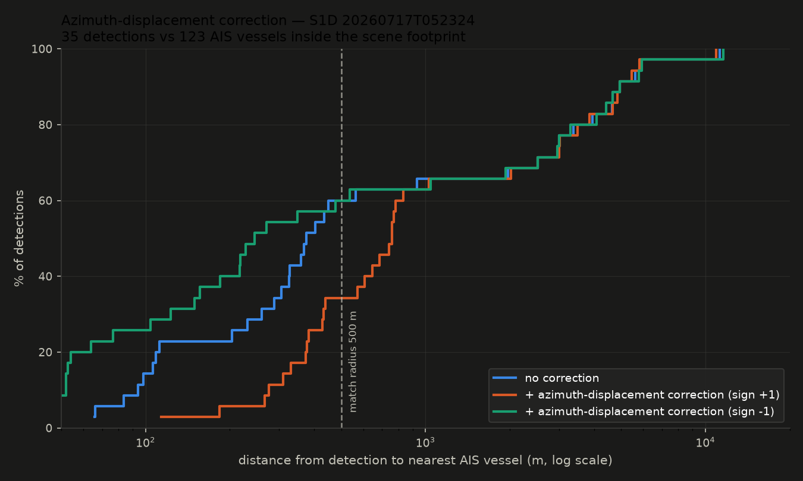
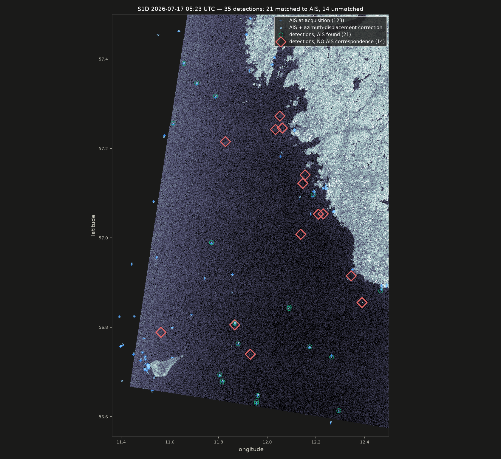

# Dark vessels: detection, and a space–time join

*Part of [NIGHTGLASS](../README.md) — the air-gapped SAR intelligence assistant.*

`make dark-proof` runs the whole chain over the Danish AOI — schema, scene, detector, AIS, the
query, then the renders. **Denmark, not Portugal, and that is the point of having two AOIs:** it
is the only one with free point-level historical AIS, so it is the only place a claim about the
matcher can be *checked* rather than asserted.

```
detections    35          in the Kattegat AOI, from one Sentinel-1 GRD granule
matched       21          an AIS vessel within 500 m of where SAR would have drawn it
dark          14          no AIS correspondence — 40.0%
```

### The detector is ours

VH channel, read in place from the SAFE zip through `/vsizip/` — no extraction, so six granules
cost 4.7 GB instead of 33 GB. `sigma0 = (DN² − noise) / A²` using the product's own calibration
and thermal-noise LUTs, then a two-parameter CFAR against block-censored clutter statistics,
connected components via `rasterio.features.shapes`, and positions from a **thin-plate-spline**
GCP transform.

That last one is worth a number. Fitting a polynomial through the 210 tie points — the obvious
thing — leaves a **mean 40 m and worst-case 185 m** geolocation error, because the geolocation
grid of a 250 km swath is not a polynomial surface. TPS interpolates through them exactly:
residual **0.000 m**, for 15× the transform cost, which is 0.15 s per 20,000 points. At a 500 m
match radius, 185 m of avoidable error is over a third of the budget.

Measured against AIS, restricted to the scene footprint and open water:

| AIS-reported length | vessels | detected within 500 m | recall |
|---|---|---|---|
| ≥ 200 m | 6 | 6 | **100%** |
| 100–200 m | 7 | 5 | 71% |
| 50–100 m | 3 | 3 | **100%** |
| **≥ 30 m** | **17** | **15** | **88%** |
| < 25 m | 37 | 3 | 8% |

The 8% on sub-25 m craft is not a defect — it is 10 m pixels meeting a 20 m hull.

### The correction that makes the match work

The matcher has to account for the offset between AIS report time and image acquisition.
There are two offsets, and keeping them apart is the substance of the fusion problem:

**Time.** A vessel at 12 kn covers 3.7 km inside a ±11 min window, so "nearest report in time"
is not a position. Each track is linearly interpolated onto the acquisition instant, in SQL,
with `LEAD` over the per-vessel track. Vessels without reports on *both* sides are dropped
rather than extrapolated — an extrapolated position that then fails to match would manufacture
a dark detection out of a gap in the feed.

**Geometry.** SAR places a target in azimuth by its Doppler, so a moving ship is drawn
`(R/V)·v_los` from where it actually was. Here R/V ≈ 115 s, so 12 kn across the range direction
is **~450 m** — most of the match radius, spent before the matcher does anything. The naive fix
is a wider radius; that is worse than it looks, because the radius is the entire boundary
between "matched" and "dark", so widening it to absorb a *predictable* offset buys false matches
at the same rate it avoids false darks. So it is computed, from the product's own annotation and
from AIS SOG/COG.

**The sign was derived one way and measured the other way, and the measurement won.**

| | <100 m | <200 m | <500 m | median |
|---|---|---|---|---|
| interpolated, no correction | 8 | 17 | 43 | 330 m |
| correction, sign **+1** (as derived) | 0 | 3 | 23 | 630 m |
| correction, sign **−1** (as measured) | **19** | **33** | **45** | **173 m** |



The wrong sign is about as far wrong as the right sign is right — the signature of a real
systematic offset being corrected backwards. The derivation had assumed the processor places a
target at the azimuth time whose Doppler equals the observed one; it actually focuses at the
target's Doppler *zero crossing*. Leaving the sign as a parameter to be measured is what caught
it.

### Land is masked twice, and it has to be

The first mask is derived from the scene: land backscatters 10–15 dB above calm sea at VH, so a
thresholded block mean finds it with no auxiliary data at all. It handles the mainland.

It cannot handle skerries, and not because it is badly tuned. It must *open* the mask — erode,
then dilate — or every bright vessel becomes its own island and the mask deletes the detections
it exists to protect. Opening removes bright objects smaller than the structuring element, and a
100 m rock is exactly that. Run with the data-derived mask alone, the detector drew a tidy line
of "vessels" down the Swedish archipelago off Gothenburg with almost no AIS anywhere near it.

So the second mask is a real shoreline: **GSHHG at full resolution**, fetched at provisioning
time and clipped to the AOI — 149 MB downloaded, 713 KB kept. The trade-off is measured, not
guessed:

| shoreline buffer | detections | matched | dark | unmatched |
|---|---|---|---|---|
| 300 m | 45 | 22 | 23 | 51% |
| **1000 m** *(default)* | **35** | **21** | **14** | **40%** |
| 2000 m | 29 | 21 | 8 | 28% |
| 3000 m | 26 | 20 | 6 | 23% |

Going from 300 m to 3 km removes 19 detections — **17 of them unmatched and only 2 matched**.
Coastal detections are overwhelmingly not vessels, and the buffer costs almost no real ones.
1 km is where that stops being nearly free.

Read the last column carefully: it is the fraction of *detections* with no AIS correspondence,
and it does not fall below 23% even three kilometres offshore. That is a statement about this
detector's false-alarm rate, not about how many ships were running dark.

### Looking at it

A detector that is only ever counted is a detector nobody has checked. Both failures above were
invisible in the numbers and obvious in the first render, so `make render` is part of the
pipeline rather than a debugging afterthought.



Matched detections carry an AIS fix inside them and sit in open water. The unmatched ones
cluster on the coastal edge — with two genuine open-water exceptions, which is exactly the kind
of thing an analyst should be handed.

Every detection at native resolution, and the AOI in radar geometry with the land mask drawn on
it, are in [`docs/evidence/`](evidence). `make dark-proof` regenerates all of it into
`data/out/`; the committed copies are the snapshot these numbers come from.

### It generalises

Every parameter above was set while looking at one Danish scene, which is a real overfitting
risk. Running the same configuration unchanged over a Lisbon-AOI granule — different platform
(S1A), different sea state, different beam geometry:

| | Kattegat (S1D, 17 Jul) | Lisbon (S1A, 13 Jun) |
|---|---|---|
| water sigma0 / NESZ | −29.1 / −29.4 dB | −26.5 / −26.5 dB |
| land-masked | 51.6% | 33.0% |
| binding criterion | CFAR | CFAR |
| detections | 60 | 133 |

No parameter touched, and the [chips](evidence/pt_chips.png) are unambiguous vessels — most
of them showing the vertical azimuth smear of a moving target. That smear is also why lengths
run large on this scene, and it is the same mechanism behind the weak length correlation
measured over Denmark.

### A second detector, over the identical granule

Denmark validates the matcher against AIS. Nothing there validates the *detector*, so the
Lisbon scene is cross-checked against Global Fishing Watch's published SAR detections — and
because each GFW feature id carries its source granule, that granule is one `make fetch-granules`
puts on disk.
This is detection-for-detection over the same pixels, not "they saw N in this box and we saw M".
`make fetch-gfw` (provision network, `GFW_TOKEN` from `~/.config/eo-credentials.env`), then
`make gfw-compare`:

```
ours           71 detections   (nightglass-cfar)
GFW            66 detections   (published layer, same granule)

both saw       49   (74% of GFW's, median separation 78 m)
GFW only       17   they found, we did not
ours only      22   we found, they did not
```

**78 m median separation between two independent detectors** — tighter than the 104 m against
DMA AIS, as it should be, since both are measuring pixels rather than pixels against a
transponder.

This comparison is what first caught the detector counting one vessel several times. Before the
merge step it reported 133 detections here, and 61% of the 84 GFW did not share sat within 200 m
of one we had both found — fragments of the same hull, not extra vessels. With merging on,
agreement is unchanged at 49 and the residue drops to 22, of which **none** is within 200 m of
an agreed detection: median distance to the nearest, 26 km. What is left is genuinely isolated —
extra sensitivity or extra false alarms, not double counting.

Denmark settled the question properly afterwards, and cheaper: 45 matched detections there
resolved to **18 distinct MMSIs**, and clustering at 100–300 m produced zero groups containing
more than one vessel. The ground truth was on the bench the whole time.

Two detectors agreeing is weaker evidence than the AIS validation banked over Denmark — it says
the detector generalises, not that either is right, and the tool prints that sentence every time
so the number is never quoted without it. GFW's own `matched` flags on the 49 agreed detections
(45 matched, 4 not) are reported as *their* computation under CC BY-NC 4.0, never merged into a
`Match`: they matched against their AIS upstream, and claiming that as our correlation would be
claiming their work.
